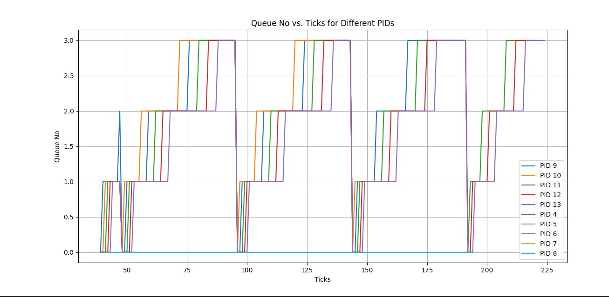

**For LBS**
1. Added `int tickets;` to the proc structure for storing lottery tickets and `uint64 arrival_time;` to track when each process was created or became runnable.

2. In allocproc function, initialized the tickets to 1: `p->tickets = 1;`
Set arrival time when allocating a new process: `p->arrival_time = current_time;`, where current_time is the time of process creation.

3. Added system call `sys_settickets` to allow processes to set their ticket counts dynamically

4. Defined function to let processes change their ticket count with `argint(0, &n);` and updated `p->tickets = n;`, returning the new ticket count.

5. Enhanced scheduler to calculate the total number of tickets for all runnable processes, and introduced logic to find process with earliest arrival time among runnable processes. Modified the scheduling loop to select a process based on both lottery ticket mechanism and arrival time.

    **Performance Comparison**

    |Scheduler  | Avg rtime |Avg wtime  |
    |-----------|-----------|-----------|
    |Default(RR)|10         |111        |
    |LBS        |8          |108        |
    |MLFQ       |13        |108       |

**Implications of Adding Arrival Time**

Adding arrival time to the lottery-based scheduler introduces priority for earlier-arriving processes, which can reduce their waiting time. However, this can cause a **convoy effect**, where processes that arrive later may experience longer delays, especially if they have fewer tickets. If all processes have the same number of tickets, the policy essentially becomes first-come, first-served

**Alarmtest**

1. Updated the system call table in `syscall.h` and `syscall.c` to include entries for `sigalarm `and `sigreturn.`

2. Created the `sys_sigalarm()` and `sig_return()` function in `sysproc.c`

3. Updated `user.h` and `usys.pl`

4. Added fields to proc structure during process allocation:

    a.) `sigalarm`: Initialized to `0`, indicating that no alarm is currently set.

    b.)`sigalarm_handler`: Initialized to `0`, which will later hold the address of the user-defined handler function for the alarm.

    c.)`sigalarm_interval`: Initialized to `-1`, indicating that no valid interval has been set for the alarm.

    d.) `CPU_ticks`: Initialized to `0`, which will track the CPU ticks consumed by the process.

**MLFQ**

1. Added a variable q_no to store the queue_no for each process,the time used in the queue and its arrival time into the queue

2. For process selection I looped thourgh the process table to find the process with min arrival_time and q_no

3. I am demoting a process once it completely uses its tiem slice in trap.c

4. Every 48 seconds i set q_no to 0 to indicate priority boost has happened

